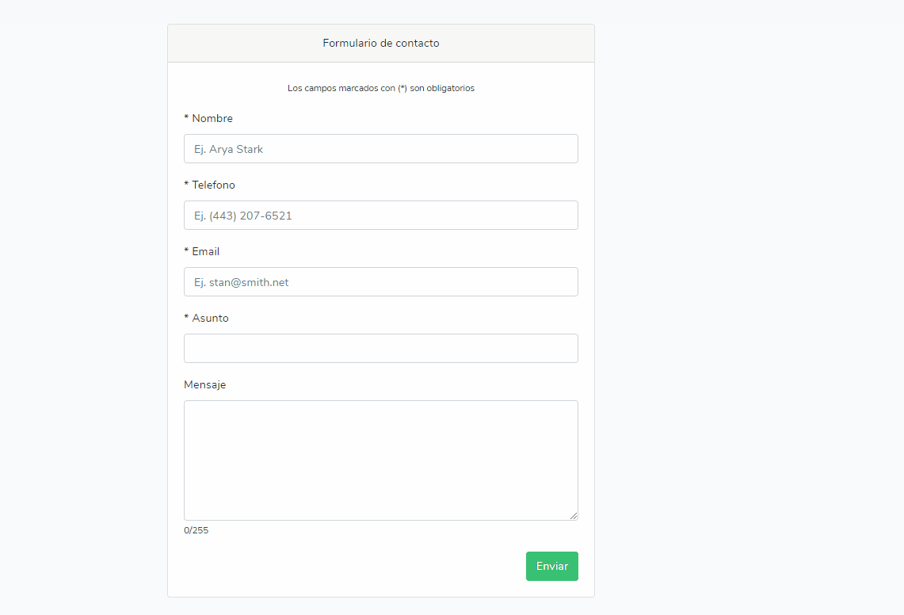
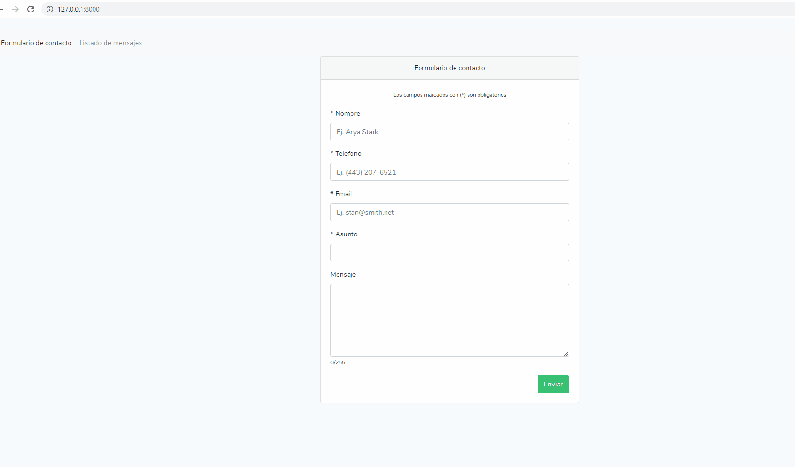

# Formulario Laravel - Vue

## Tabla de contenido

* [Acerca de](#acerca-de-este-proyecto)
* [Requerimientos y herramientas](#requerimientos-y-herramientas)
* [Como instalar](#como-instalar)
* [Usar](#usar)
* [Demo](#demo)
* [Licencia](#licencia)

## Acerca de este proyecto

Lorem ipsum dolor sit amet

## Requerimientos y herramientas

* Laravel Framework 8.11.2
* PHP 7.4.11
* Node.js v12.16.3

## Como instalar

* Para instalar paquetes necesarios de composer para laravel
```
$ composer i
```

* Para instalar modules necesarios de node
```
$ npm i
```

## Usar
### Cabe resaltar que todo debe ser sobre la raiz del proyecto
* Para correr el proyecto (Backend)
```
$ php artisan serve --port=8000
```

* Para poder correr el proyecto (Frontend) en modo desarrollo se recomienda
```
$ npm run dev
```

* o

```
$ npm run watch
```

* Para poder generar algunos datos de prueba
```
php artisan migrate:refresh --seed
```

* Es probable que si corre el proyecto en un virtualhost de apache tenga que cambiar la url base de Axios, esta se encuentra en el archivo resources\js\app.js (se recomienda correr el proyecto en localhost en el puerto 8000).

```
axios.defaults.baseURL = 'http://127.0.0.1:8000/api/';
```
* Se incluyo un dump de base de datos el cual esta en "contato_tma.sql"


## Demo

* Validación de formulario y notificación de "envío"


* SPA vue-router, paginación y visualización de un mensaje


## Licencia

[MIT](LICENSE).
